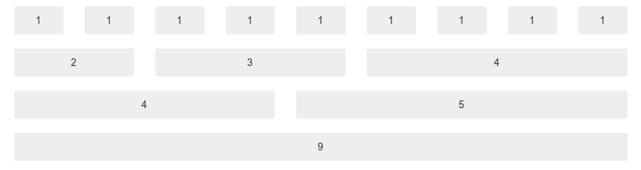
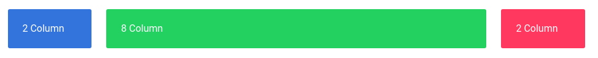
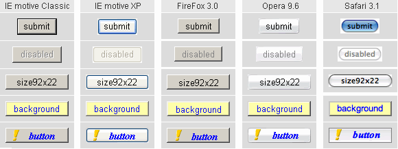
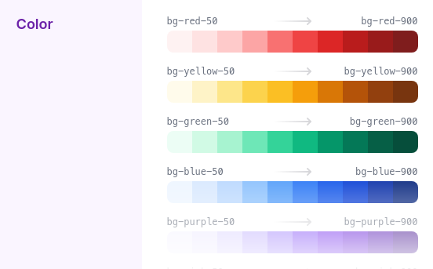

# **TailwindCSS** 

## An API for your design system.

---

# CSS Frameworks

## What are they supposed to do?

- Make it easier to work against a design system 
- Be extendable for more bespoke UI components

---

# CSS Framworks

## What are they **NOT** supposed to do?

- Make it hard to change the default styling
- Couple unwanted behaviour with style
- Be boring 

---

# Problems to solve

- Abstract/normalize browsers 
- Provide a layout system with responsiveness
- Provide consistent spacing, colours, etc
- The ability to make changes with confidence

----


# Types of CSS systems

- CSS Frameworks (Bootstrap, Bulma, Foundation)
- CSS-in-JS (Emotion, styled-components, Glamour)
- Web Components
- BEM / CSS Modules
- Utility-first CSS (Atomic, **TailwindCSS**)

----

# **Boostrap** CSS

One of the originals.
Bootstrap is a CSS framework designed and developed by Twitter. 

### Giving designers a (960) grid and loads more...



----

# **Bulma** example

Semantic class names.

```html
<div class="columns">
    <div class="column is-2">
        <p class="notification is-info">2 Column</p>
    </div>
    <div class="column is-8">
        <p class="notification is-success">8 Column</p>
      ...
```



----

# Do we need frameworks?

We now have browser support for a lot of built-in functionality and CSS preprocessors.

----

# Normalize(.css) 

_Make browsers consistent_ - Normalizing has a standard polyfill today. 

It's called normalize.css 



----

# CSS Preprocessors


Making it easier to write CSS.

- **Sass** - _Syntactically Awesome Style Sheets_
- **Less** - _LEaner Style Sheets_
- (CSS-in-JS) - More on this later

Consistent spacing, font sizes, colours.
Object oriented styles.

---

# CSS Preprocessors

Making it ~~easier~~ messier to write CSS.

```scss
/* style.scss */
@import './colors'; /* Modularity through imports */

$primary: #123123; /* Variables for consistency */

a {
  color: $primary;

  &:hover { /* Nesting rules */
    color: darken($primary, 20%); /* Functions */
  }
}
```

---

# Grids and modern CSS

_Provide a layout system_ 

<!-- backgroundColor: #f8f8f0 -->

In 2021 all modern browsers support Grid Layout. 
As well as media query breakpoints for mobile, etc.


----

# CSS Variables

Pretty much only IE 11 doesn't support it ✗

```css
:root { /* Just the global selector */
  --primary: #123123;
}

a {
  color: var(--primary, blue);
}
```

--- 


## **Cascading** Style Sheets

_Making changes with confidence_
CSS (**Cascading**) Sucks.

Isolating components from each other to minimize madness.
Ways to address this:
- Block Element Modifier (B.E.M.)
- CSS Modules

----


## BEM flat class names

```css
.button {
	border-radius: 3px;
	padding: 7px 12px;
	border: 1px solid #D5D5D5;
}
.button--state-success {
	color: #FFF;
	border-color: #4A993E;
}
.button--state-danger {
	color: #900;
}
```
----

## CSS Modules, like BEM but automatic. 

Generates unique class names automagically

```css
a {
  color: blue;
  text-decoration: underline;
}
```
```jsx
import classes from './style.css'

const Link = (props) => <a className={classes.a} {...props} />
```

Yeilds: `<a class="a-5b2d5ecc" />`

----

# Problems / solutions

- Abstract/normalize browsers: **normalize.css** 
- Provide a layout system with responsiveness: **Grid Layout / @media()**
- Provide consistent spacing, colours, etc: **Preprocessor or CSS variables**
- The ability to make changes with confidence: **BEM / CSS Modules**

---

# So utility-first CSS?

It's kinda silly.
One class for each rule.

```css
.inline {
  display: inline-block;
}
```

```html
<div class="inline">
   Hello
</div>
```

---


# Utility-first CSS

```css
.grid {
  display: grid;
}
.grid-cols-3 {
  grid-template-columns: repeat(3, minmax(0, 1fr));
}
```

```html
<div class="grid grid-cols-3">
  <div> 1 </div>
  <div> 2 </div>
  <div> 3 </div>
</div>
```

---


# Utility-first CSS - Challenges

Did you see `grid-cols-3`? 
Since these are class names there is no way of providing arguments.

We have to cover all our bases...

```css
.grid-cols-3 { grid-template-columns: repeat(3, minmax(0, 1fr)); }
.grid-cols-4 { grid-template-columns: repeat(4, minmax(0, 1fr)); }
.grid-cols-5 { grid-template-columns: repeat(5, minmax(0, 1fr)); }
/* ... /*
```
That's a lot of class names.

---

# Enter TailwindCSS

TailwindCSS generates classes based on a config file.

This gives you two things:

1. You're able to extend TailwindCSS
2. You have a central place where you define your "sub-atoms"

---

# What does TailwindCSS look like?


```html
<div class="py-12 bg-white">
  <div class="max-w-7xl mx-auto px-4 sm:px-6 lg:px-8">
    <div class="lg:text-center">
      <h2 class="text-base text-indigo-600 font-semibold tracking-wide uppercase">Header</h2>
      <p class="mt-2 text-3xl leading-8 font-extrabold tracking-tight text-gray-900 sm:text-4xl">
        When you think you have enough classes...
      </p>
      ...
      

```

OMG it's aweful! Make it stop

----

# How do I compose this?

If you want to re-use styles, don't make a new CSS classes! 
Use your frontend framework instead.


```jsx
// React.js
const Link = ({link, children}) => {
  return (
    <a href={link} classNames="text-blue-400 hover:underline">
    { children } 
    </a>
  )
}
```

---

# Does this solve anything?

#### Problems / solutions
- Abstract/normalize browsers: **normalize.css** (Same)
- Provide a layout system with responsiveness: Yup, using **CSS standards**.
- Provide consistent spacing, colours, etc: **tailwind.config.js**
- The ability to make changes with confidence: **There is no cascading!**

---

# Why is this better than <insert>?

Because you don't need to write CSS :grin:

Oh, and because it's all about small composeable units.




---

# Why do I like it?

- It scales well. 
- You can safely change components. No more inhertience.
- You have a (small) central file for your sub-atoms.
- You stay in one file (your markup).
- Less magic.
- It's fun!

---

# Bundle size

The default style sheet is fat (2.7mb!)
- https://unpkg.com/tailwindcss@%5E2/dist/tailwind.min.css

But we can purge them, reducing production css bundles 
to around **16kb** or so!

It scans your code for classes you use and deletes all others.

---

# Demo

- Installing TailwindCSS
- Using it for basic styles
- Adding a colour
- SVGs and icons 
- One-off css
- Third party libraries and @apply

---

# Links

https://github.com/ponelat/tailwindcss-example

https://TailwindCSS.com
https://TailwindUI.com
https://play.tailwindcss.com/

